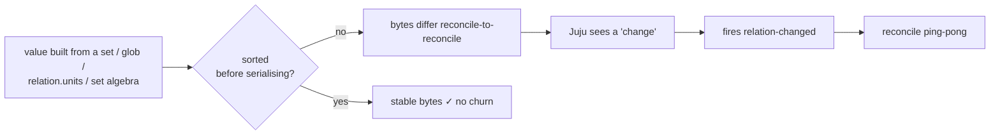
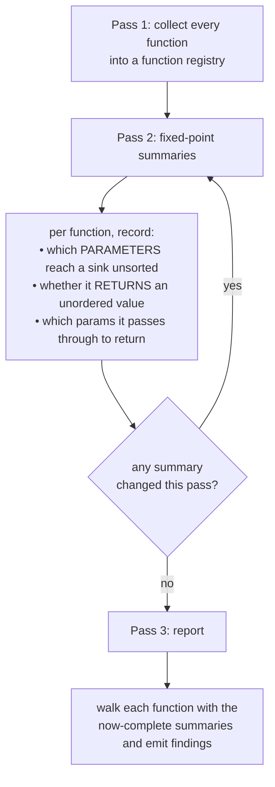
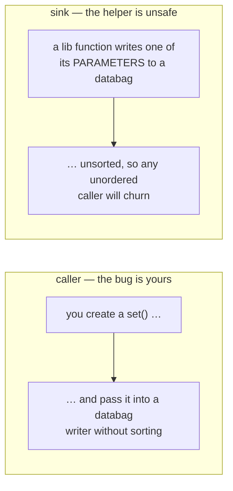
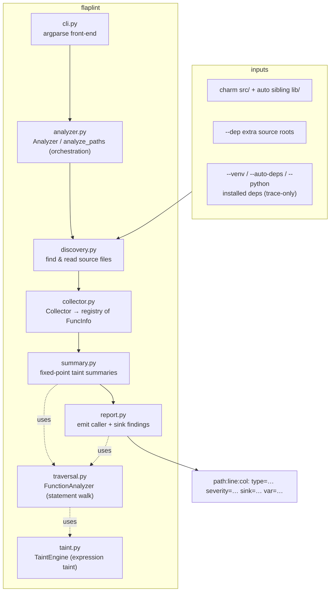

# flaplint

> **Keep your charm's databags steady, your reconcilers quiet.**

`flaplint` is a static analyser for Juju charms. It reads your charm's source code and flags every place a value that has no stable byte-order (a `set`, a `glob`, a `uuid4()`, …) reaches a *churn-sensitive sink*: a relation databag, a config file, or a content-hash restart gate.

The classic case is a relation-databag write: Juju fires endless `relation-changed` events and sends two charms into a reconcile ping-pong. But the *same* instability also flaps a rendered config or pebble layer and content-hash restart gates. So `flaplint` checks all three. See [§c](#c-what-it-recognises-sources-propagators-sanitisers-sinks) for the full sink list.


---

## a. The bug it hunts

Charms talk through relation databags. Juju has one rule that makes ordering matter:

> Juju notifies the other side only when the text of a databag value changes.

It compares bytes, not meaning. So if your charm serialises a `set` (or a `dict`/list
*built from* a set, a `glob`, `os.listdir`, set algebra, …) without sorting, the bytes
come out in a different order each reconcile:

```json
["alice", "bob"]      (reconcile 1)
["bob", "alice"]      (reconcile 2)
```

Juju sees a "change", wakes the remote charm with `relation-changed`, it rewrites *its*
databag in a new order, wakes you back… and two charms ping-pong forever. This is
churn, and the fix is almost always:

```python
json.dumps(sorted(datasources, key=lambda d: d["uid"]))   # ← sorted()
```

This linter finds the spots where we forgot to sort bedore writing.



### Why read the source instead of running it?

The bug is a *latent* property of the code: a value's order is unstable whether or not a
test ever exercises that relation. Reading the source means every code path is in
scope, including the relations, branches and error handlers a test suite never drives.


The trade-off is honesty about uncertainty. When a value's true origin can't be traced (it arrives as an untyped parameter from far away), the tool can't be sure. So it is a
*flagger*: it ranks findings by confidence and leaves the final call to you.

---

## b. How to use it

Install the package and a `flaplint` command is put on your `PATH`:

```bash
pip install -e .          # or: uv pip install -e .
```

You can also run it without installing, straight from the source tree, via
`python -m flaplint`.

```bash
# the common case: scan a charm's src/ (its sibling lib/ is auto-included)
flaplint /path/to/my-charm/src

# scan a checked-out library source tree as well, and report on it
flaplint my-charm/src --dep ../cos-lib/src

# follow into installed dependencies (cosl, ops, …) to resolve calls,
# but only *report* problems inside your own code
flaplint my-charm/src --venv my-charm/.venv

# auto-detect which installed deps write to relation data and trace only
# those — finds a sibling .venv/venv for you (great for coordinated-workers)
flaplint my-charm/src --auto-deps

# resolve deps through a working interpreter (a `uv sync` .venv, a tox env, …)
# — handles namespace packages (charmlibs.interfaces.*) that a directory scan
# misses, and installs nothing
flaplint my-charm/src --python my-charm/.venv/bin/python

# CI gate: only surface the confident findings, machine-readable
flaplint my-charm/src --min-confidence high --json

# no-install equivalent (e.g. in a checkout without the entry point)
python -m flaplint my-charm/src --min-confidence high --json
```

It is also importable as a library — `analyze_paths(...)` returns a list of
`Finding` objects, and the `Analyzer` class exposes the same options as keyword
arguments:

```python
from flaplint import analyze_paths

findings = analyze_paths(["my-charm/src"], min_confidence="high")
for f in findings:
    print(f.format())
```

**Exit code** is `1` when any finding survives the confidence threshold, `0` when clean.

### Flags

| Flag | Meaning |
|------|---------|
| `paths…` | charm source files or directories to scan and report on |
| `--dep PATH` | extra source root to analyse and report on (e.g. a vendored lib) |
| `--venv PATH` | virtualenv / `site-packages` to trace into for call resolution only |
| `--auto-deps` | auto-detect which installed deps write to relation data and trace only those (locates a sibling `.venv`/`venv` if no `--venv` is given) |
| `--python PATH` | resolve the charm's deps through an existing interpreter's import system (e.g. a `uv sync` `.venv`'s `bin/python`); namespace-package-aware, *installs nothing*, traces only the deps that write databags |
| `--report-deps` | also report findings *inside* `--venv` packages (default: trace only) |
| `--min-confidence {low,medium,high}` | reporting threshold (default `medium`) |
| `--sort {criticality,location}` | finding order: most severe first, or by file location (default `criticality`) |
| `--json` | emit JSON instead of `path:line:col` text |

> For how `--venv`, `--auto-deps` and `--python` discover *vendored* vs *installed*
> libraries (and why `--python` is the most robust), see
> [Resolving charm dependencies](docs/resolving-dependencies.md).

### Silencing a known-good line

If a list's order is genuinely meaningful, annotate it:

```python
relation.data[self.app]["priorities"] = json.dumps(items)  # databag-order: ignore
```

---

## c. What it recognises: sources, propagators, sanitisers, sinks

- **Sources** (order-unstable origins): `set`, `frozenset`, set literals & set
  comprehensions, set algebra (`|`, `&`, `^`, `-`), and the filesystem walkers
  (`glob`, `iglob`, `listdir`, `scandir`, `walk`, `iterdir`, `rglob`). Also a parameter
  whose annotation says it may be unordered (`Set`, `Iterable`, `Collection`, `KeysView`, …).
- **Propagators** (taint flows through): `list`, `tuple`, `reversed`, `join`, and
  comprehensions iterating a tainted value. Serialisation is a propagator too —
  `json.dumps(x)`'s bytes are only as stable as `x`.
- **Sanitisers** (taint cleared): `sorted(...)`, `.sort()`, and `json.dumps(..., sort_keys=True)`
  (PyYAML's `dump`/`safe_dump` sort keys *by default*, so only an explicit `sort_keys=False`
  re-introduces instability).
- **Volatile sources** (nondeterministic — always high confidence): `uuid4`, `uuid1`,
  `time`, `monotonic`, `random`, `token_hex`, `token_bytes`. Sorting cannot fix these.
- **Sinks** (where instability bites -> each tagged `sink=` in the output):
  - **`databag`**: a relation-data write in any of its shapes.
  - **`config`**: content rendered, where churn forces a false
    `replan()` / restart: `container.push(path, source)`,
    `path.write_text(…)` / `write_bytes(…)`, and a function that `return`s a rendered blob
    (`return yaml.dump(x)` / `json.dumps(x)`) for a consumer to diff.
  - **`hash`**: a content-hash change-detector (`sha256(str(x))`, `md5`, `blake2b`, …)
    whose digest gates a restart/replan.


---

## d. The underlying concept: taint with function summaries

Most real bugs aren't local. The unordered value is created in your charm and handed to
a library/helper several calls deep that does the actual databag write. To see across
that boundary, the linter computes a `summary` for every function, then iterates to a
fixed point:



Because a helper's summary captures "parameter *N* gets written to a databag without
sorting," a call site can be flagged even when the dangerous write lives in a different
file. Receiver-class inference (`ProviderClass(...).publish(...)` or `x = ProviderClass()`)
narrows method calls to the right class so a safe `SortedProvider` isn't blamed for an
unsorted `Provider`.

### Two kinds of finding



- `caller` (always high confidence): a value *born unordered in this function*
  reaches a databag sink (possibly through library calls) without a `sorted()`. This is a
  concrete bug at that line.
- `sink` (high / medium):** a function writes one of its **parameters** to a databag
  unsorted. Confidence is **high** if the parameter is annotated as an unordered type
  (`Set`, `Iterable`, …), **medium** if it's generic (`Any`, `Dict`), and it's **skipped**
  entirely if the parameter is annotated as already-ordered (`list`, `Sequence`, `Tuple`,
  `str`) — then sorting is the caller's job, not the helper's.

`caller`/`sink` is the **vantage** (whose code to fix); orthogonal to it, every finding also
carries a `type=` **failure mode** (`unordered-collection`, `unordered-pick`,
`nondeterministic`) that says *how* to fix it — see [Reading the output](#f-reading-the-output).

---

## e. Architecture & detailed workflow

A four-stage pipeline with each pass in its own module:



### The detailed walk

1. Discover (`discovery.py`) — resolve the inputs into source files: the charm's
   `src/`, its sibling `lib/`, any `--dep` roots, and — for
   resolution only — installed deps located via `--venv` (a named site-packages),
   `--auto-deps` (a sibling venv, narrowed to databag writers) or `--python` (an
   interpreter's import system, namespace-package-aware). `tests/` is skipped. Files are
   split into **primary** (reported) and **secondary** (traced-only) sets.
2. Collect (`collector.py`) — one `ast` visit per file registers every function and
   method (plus module-level code as a `<module>` pseudo-function) into a **registry** keyed
   by bare name. Each entry is a `FuncInfo` holding its AST node, parameters, annotations and
   class. Per-class member types (`self.x: Set[str]`) are recorded too, so attribute reads
   can be typed.
3. Summarise (`summary.py` → `traversal.py` → `taint.py`) — repeatedly walk every
   function until no summary changes:
   - `FunctionAnalyzer` walks a function's statements, tracking which locals are tainted and
     with what **origin**.
   - For each expression it asks `TaintEngine.eval(node, env)`, the heart of the tool, which
     returns the origins that make it unstable — `"local"` (born here), `"volatile"`
     (nondeterministic) or `("param", i)` (inherited from parameter *i*). **Empty set =
     stable.** It handles literals, names, calls (sources, sanitisers, propagators, and
     *other functions* via their summaries), comprehensions, subscripts, attribute reads and
     f-strings.
   - When taint reaches a sink, a `SummaryHandler` records *which parameter* was responsible
     (the function's `dangerous` set); returns update `returns_unordered` / `returns_params`.
   - Because callers depend on callee summaries and vice-versa, the loop re-runs to a **fixed
     point** — every summary is then complete and independent of file parse order.
4. Report (`report.py`) — a final `FunctionAnalyzer` pass over the **primary** functions,
   now with complete summaries, using a `ReportHandler` that turns each taint-into-sink flow
   into a `Finding`. It then drops findings below `--min-confidence`, honours
   `# databag-order: ignore`, **deduplicates** by `(path, line, col, kind)`, and sorts by
   path/line.

**No globals.** The registry, per-class member types and the `--relations-unordered` toggle
all live on the `TaintEngine` *instance*, threaded in by the `Analyzer`. Two analyses with
different options never leak state into each other — which is exactly what lets the test
suite lint dozens of inline snippets independently.

### Module map

| Module | Responsibility |
|--------|----------------|
| `constants.py` | the matched name-sets (sources, sanitisers, volatile calls, …) — pure data |
| `model.py` | `Finding`, `FuncInfo`, `Origin`, `Registry` dataclasses/aliases |
| `astutils.py` | pure AST helpers (`final_attr`, `root_name`, `loop_accumulators`, …) |
| `taint.py` | **`TaintEngine`** — given an expression, the origins that make it unstable |
| `traversal.py` | **`FunctionAnalyzer`** — flows taint through one function's statements to sinks |
| `handlers.py` | `SummaryHandler` / `ReportHandler` — what to do at a sink/return |
| `summary.py` | `compute_summaries` — the fixed-point iteration |
| `report.py` | `report` — turn summaries into deduplicated, suppression-aware findings |
| `collector.py` | `Collector` — register every function/method into the registry |
| `discovery.py` | locate and read source files (charm, sibling lib, `--venv`) |
| `analyzer.py` | `Analyzer` / `analyze_paths` — high-level orchestration & the public API |
| `cli.py` | the `flaplint` command |

- **`TaintEngine.eval(node, env)`** — the heart: given an expression, returns the set of
  *origins* (`"local"`, `"volatile"`, or `("param", i)`) that make it unstable. Empty set =
  stable. Analysis configuration (the registry, per-class member types, the
  `--relations-unordered` toggle) lives on the engine instance — there are **no module
  globals**, so two analyses with different options never interfere.
- **`Collector`** — one AST visit per file, registering every function/method (and
  module-level code as a `<module>` pseudo-function) into a registry keyed by name.
- **`compute_summaries`** — repeats the taint walk over every function until no summary
  changes (fixed point), so callee facts are available to callers regardless of file order.
- **`report`** — a final walk that turns surviving taint-into-sink flows into `Finding`s,
  applies the confidence threshold, and honours `# databag-order: ignore`.

The `--venv` trees are parsed for **resolution only** — their functions inform summaries so
a call into `cosl` resolves correctly, but findings inside them are suppressed unless you
pass `--report-deps`.

### A worked example

```python
# lib/charms/foo/v0/foo.py
class Provider:
    def publish(self, relation, items):                         # 'items' unannotated
        relation.data[self.app]["peers"] = json.dumps(items)    # ← sink

# src/charm.py
def _on_changed(self, event):
    peers = {u.name for u in self.model.relations["foo"]}        # set comprehension → SOURCE
    Provider().publish(event.relation, peers)                   # passes the set in
```

- **Collect** registers `Provider.publish` and `_on_changed`.
- **Summarise** walks `publish`: parameter `items` is serialised straight into a databag
  with no `sorted()`, so `publish`'s summary marks **parameter 1 dangerous** (medium —
  `items` is unannotated).
- **Report** walks `_on_changed`: `peers` is born from a set comprehension (`"local"`). The
  call `Provider().publish(event.relation, peers)` matches `publish`'s summary — argument 1
  is dangerous and `peers` arrived unsorted — so it emits a **`caller/high`** finding at the
  call line, plus a **`sink/medium`** finding inside `foo.py`.
- The fix is one word: `sorted(peers)` at the call site, or sort inside `publish`.


---

## f. Reading the output

```text
src/charm.py:142:9: type=unordered-collection severity=high sink=databag var=peers
src/coordinator.py:229:42: type=unordered-pick severity=high sink=config var=scheduler_addrs
src/charm.py:51:13: type=nondeterministic severity=high sink=databag var=uuid4
lib/charms/grafana_k8s/v0/grafana_dashboard.py:1359:9: [warning] type=nondeterministic severity=high sink=databag var=json

4 potential databag-ordering issue(s): 3 error(s), 1 warning(s) (fix lives in a dependency / vendored lib) across 11 file(s) (+0 dependency file(s) traced).
```

Each line is `path:line:col:` followed by an optional `[warning]` marker and four flat fields:

| Field | Meaning |
|-------|---------|
| `type=` | **which failure mode** — one of the three below; tells you *how to fix it* |
| `severity=` | `high` / `medium` / `low` confidence that this is a real bug |
| `sink=` | where the value lands: `databag`, `config` (a rendered workload config), or `hash` (a content-hash restart gate) |
| `var=` | the **affected variable** — the identifier to go look at (`peers`, `scheduler_addrs`, or the volatile call `uuid4`) |

### Errors vs warnings — *who can fix it*

The `[warning]` marker (and `level` in `--json`) splits findings by **where the fix lives**,
because you can only fix code you own:

| Level | The fix lives in… | Exit code |
|-------|-------------------|-----------|
| **error** (no marker) | code the scanned charm **owns** — its `src/`, or its own `lib/charms/<charm-name>/` namespace | counts toward a non-zero exit (**fails CI**) |
| **`[warning]`** | a library the charm only **consumes** — an installed Python package (e.g. `cos-coordinated-workers`) or a *vendored* copy of **another** charm's lib (`lib/charms/<other-charm>/`) | reported but **non-blocking** (exit `0` if only warnings) |

The charm name comes from `charmcraft.yaml` (falling back to `metadata.yaml`); the owned
charm-lib namespace is that name with `-` → `_` (so `mimir-coordinator-k8s` owns
`lib/charms/mimir_coordinator_k8s/`, and every *other* `lib/charms/<x>/` is a vendored copy
it cannot fix). The run only fails when at least one **error** survives the confidence
threshold — a charm whose only findings sit in dependencies it doesn't own stays green.

### The three failure modes (`type=`)

They are deliberately non-overlapping — each names a *distinct* root cause with a
*distinct* fix:

| `type=` | What went wrong | The fix |
|---------|-----------------|---------|
| **`unordered-collection`** | a whole `set`/`dict`/`relation.units` is serialised without `sorted()`, so its **bytes reshuffle** between reconciles | wrap it in `sorted(...)` (or `json.dumps(..., sort_keys=True)` for dict keys) before writing |
| **`unordered-pick`** | a single element is chosen by **position** from an unordered collection (`addrs[0]`), so *which* element you get changes run-to-run — this **survives `sort_keys=True`** | `sorted(addrs)[0]`: sort *before* indexing, not at the serialiser |
| **`nondeterministic`** | the value is **regenerated every reconcile** (`uuid4()`, `time()`, `random()`); it is different even when sorted | make it **stable** — derive it deterministically, or persist it once and reuse it; sorting cannot help |

The reported line:col is always *where to fix it*. For `unordered-pick` that is the **pick
itself** (e.g. `addrs[0]`), not the blameless serialiser downstream — because sorting the
serialiser would not change which element was picked.

> **`var=` for `nondeterministic`** names the regenerating call (`uuid4`, `time`, …) when it
> is visible at the sink; when the volatile value arrives from another function it falls back
> to the serialiser/variable name reaching the sink.

The vantage point — *who owns the bug* — is reported separately as the finding `kind`
(visible in `--json` as `kind`):

- **`kind=caller`** — a value *born unstable in this function* reaches the sink: fix it here.
- **`kind=sink`** — a helper writes one of its **parameters** to a databag unsorted (an
  `unordered-collection` at the contract boundary): sort inside the helper, or make every
  caller sort. Confidence is graded by the parameter's annotation.


---


