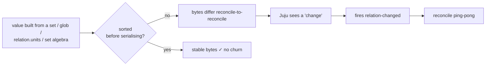
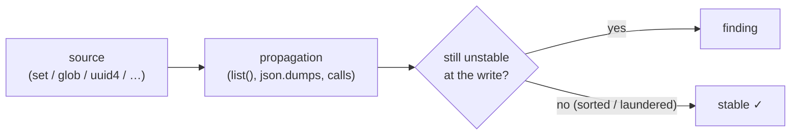

# flaplint

> **Keep your charm's databags steady, your reconcilers quiet.**

`flaplint` is a static analyser for Juju charms. It reads your charm's source code and flags every place a value that has no stable byte-order (a `set`, a `glob`, a `uuid4()`, …) reaches a *churn-sensitive sink*: a relation databag, an on-disk file, or a content-hash change-detector.

The classic case is a relation-databag write: Juju fires endless `relation-changed` events and sends two charms into a reconcile ping-pong. But the *same* instability also flaps an on-disk file (a rendered config, pebble layer, or any file used as a change-detector) and content-hash change-detectors — both of which gate a restart / replan / re-sync. So `flaplint` checks all three.

> **Want the internals?** This README is the overview. For how the analysis
> actually works — the taint model, sink discovery, the inter-procedural pass —
> see **[docs/](docs/README.md)**.

---

## a. The bug it hunts

Charms talk through relation databags. Juju has one rule that makes ordering matter:

> Juju notifies the other side only when the text of a databag value changes.

It compares bytes, not meaning. So if your charm serialises a `set` (or a `dict`/list
*built from* a set, a `glob`, `os.listdir`, set algebra, …) without sorting, the bytes
come out in a different order each reconcile:

```json
["alice", "bob"]      (reconcile 1)
["bob", "alice"]      (reconcile 2)
```

Juju sees a "change", wakes the remote charm with `relation-changed`, it rewrites *its*
databag in a new order, wakes you back… and two charms ping-pong forever. This is
churn, and the fix is almost always:

```python
json.dumps(sorted(datasources, key=lambda d: d["uid"]))   # ← sorted()
```

This linter finds the spots where we forgot to sort before writing.



### Why read the source instead of running it?

The bug is a *latent* property of the code: a value's order is unstable whether or not a
test ever exercises that relation. Reading the source means every code path is in
scope, including the relations, branches and error handlers a test suite never drives.

The trade-off is honesty about uncertainty. When a value's true origin can't be traced (it arrives as an untyped parameter from far away), the tool can't be sure. So it is a
*flagger*: it ranks findings by confidence and leaves the final call to you.

---

## b. How to use it

Install the package and a `flaplint` command is put on your `PATH`:

```bash
pip install -e .          # or: uv pip install -e .
```

You can also run it without installing, straight from the source tree, via
`python -m flaplint`.

```bash
# the common case: scan a charm's src/ (its sibling lib/ is auto-included)
flaplint /path/to/my-charm/src

# scan a checked-out library source tree as well, and report on it
flaplint my-charm/src --dep ../cos-lib/src

# follow into installed dependencies (cosl, ops, …) to resolve calls,
# but only *report* problems inside your own code
flaplint my-charm/src --venv my-charm/.venv

# auto-detect which installed deps write to relation data and trace only
# those — finds a sibling .venv/venv for you (great for coordinated-workers)
flaplint my-charm/src --auto-deps

# resolve deps through a working interpreter (a `uv sync` .venv, a tox env, …)
# — handles namespace packages (charmlibs.interfaces.*) that a directory scan
# misses, and installs nothing
flaplint my-charm/src --python my-charm/.venv/bin/python

# CI gate: only surface the confident findings, machine-readable
flaplint my-charm/src --min-confidence high --json

# no-install equivalent (e.g. in a checkout without the entry point)
python -m flaplint my-charm/src --min-confidence high --json
```

It is also importable as a library — `analyze_paths(...)` returns a list of
`Finding` objects, and the `Analyzer` class exposes the same options as keyword
arguments:

```python
from flaplint import analyze_paths

findings = analyze_paths(["my-charm/src"], min_confidence="high")
for f in findings:
    print(f.format())
```

**Exit code** is `1` when any finding survives the confidence threshold, `0` when clean.

### Flags

| Flag | Meaning |
|------|---------|
| `paths…` | charm source files or directories to scan and report on |
| `--dep PATH` | extra source root to analyse and report on (e.g. a vendored lib) |
| `--venv PATH` | virtualenv / `site-packages` to trace into for call resolution only |
| `--auto-deps` | auto-detect which installed deps write to relation data and trace only those (locates a sibling `.venv`/`venv` if no `--venv` is given) |
| `--python PATH` | resolve the charm's deps through an existing interpreter's import system (e.g. a `uv sync` `.venv`'s `bin/python`); namespace-package-aware, *installs nothing*, traces only the deps that write databags |
| `--report-deps` | also report findings *inside* `--venv` packages (default: trace only) |
| `--min-confidence {low,medium,high}` | reporting threshold (default `medium`) |
| `--sort {criticality,location}` | finding order: most severe first, or by file location (default `criticality`) |
| `--format {pretty,concise,json}` | output style: grouped colour report (`pretty`, default), one-line-per-finding for editors/grep (`concise`), or machine `json` |
| `--json` | alias for `--format json` |

> Colour in `pretty` mode is emitted only to a terminal; it auto-disables when
> piped or in CI, and honours the `NO_COLOR` / `FORCE_COLOR` conventions.

> For how `--venv`, `--auto-deps` and `--python` discover *vendored* vs *installed*
> libraries (and why `--python` is the most robust), see
> [Resolving charm dependencies](docs/resolving-dependencies.md).

### Silencing a known-good line

If a list's order is genuinely meaningful, annotate it:

```python
relation.data[self.app]["priorities"] = json.dumps(items)  # databag-order: ignore
```

---

## c. How it works

`flaplint` is a small **taint analysis**. It tracks values that have no stable
byte-order from where they're *born* to where they're *written*, across function
boundaries, and flags the writes.



The pieces, each with a dedicated deep-dive in **[docs/](docs/README.md)**:

- **A taint model** decides whether an expression is order-unstable and *why* —
  labelling it with one of six **origins** (`local`, `element`, `itercaller`,
  `iterparam`, `volatile`, `param`). The crucial distinction is which fix applies:
  a bare `set` is laundered by a key-sorting serializer, but a `list(set)` is not.
  → **[docs/taint-model.md](docs/taint-model.md)**
- **Sink discovery** recognises the three churn-sensitive write shapes —
  `databag`, `file`, and `hash` change-detectors. → **[docs/sinks-and-findings.md](docs/sinks-and-findings.md#sink-discovery)**
- **Inter-procedural summaries** let it see across calls: the unordered value is
  usually created in your charm and written by a library helper several calls
  deep. A fixed-point pass computes a summary per function so a call site can be
  flagged even when the write lives in another file. → **[docs/architecture.md](docs/architecture.md)**
- **Findings** carry a *vantage* (`caller` = a concrete bug here; `sink` = a helper
  that trusts callers to pass ordered data) and one of four *failure modes*. →
  **[docs/sinks-and-findings.md](docs/sinks-and-findings.md#from-taint-to-finding)**

---

## d. Reading the output

By default `flaplint` prints a **grouped, colourised report**: findings are
gathered under each file, aligned, marked by *who can fix it*, and annotated with
a plain-English *what / why / fix* so you don't have to memorise the rule names.

```text
flaplint  · relation-databag flapping check

src/charm.py  · 3 error(s)
  ✖  142:9  unordered collection · peers → databag  [high]
            a set/dict is serialised without sorted(), so its bytes reshuffle
            from one reconcile to the next; downstream: spurious relation-changed churn
            fix: sort before writing — json.dumps(sorted(x)) (or sort_keys=True for dict keys)
            ↳ born at src/utils.py:20, written via _collect()
  ✖  51:13  nondeterministic value · uuid4 → databag  [high]
            the value is regenerated every reconcile, so it differs even when sorted;
            downstream: spurious relation-changed churn
            fix: make it stable — derive it deterministically, or persist it once and reuse it

lib/charms/grafana_k8s/v0/grafana_dashboard.py  · 1 warning(s)
  ▲ 1359:9  nondeterministic value · json → databag  [high]
            the value is regenerated every reconcile, so it differs even when sorted;
            downstream: spurious relation-changed churn
            fix lives in a dependency you don't own — reported for awareness, doesn't fail CI

────────────────────────────────────────────────────────
  ✖ 4 problem(s)   3 error(s)   1 warning(s)   · 11 file(s) scanned
```

Each finding's first line reads `mark line:col  <failure mode> · <variable> → <sink>  [confidence]`:

| Part | Meaning |
|------|---------|
| `✖` / `▲` | **who can fix it** — `✖` is code you own (fails CI); `▲` lives in a dependency (non-blocking) |
| `line:col` | **where to fix it** — for `unordered-pick` this is the pick itself, not the blameless serialiser |
| failure mode | one of the four root causes; tells you *how to fix it* (see below) |
| `· <variable>` | the **affected identifier** to go look at (`peers`, `scheduler_addrs`, or the volatile call `uuid4`) |
| `→ <sink>` | where the value lands: `databag`, an `on-disk file`, or a `content hash` (both change-detectors) |
| `[confidence]` | `high` / `medium` / `low` confidence that this is a real bug |

The indented lines explain *why* it flaps, the concrete *fix*, and — when the value
is born elsewhere — a `↳ born at …` provenance trail back to its origin.

### Machine-readable / editor output

For editors, `grep`, or scripts, `--format concise` emits one flat line per finding
(and `--json` emits the structured records):

```text
src/charm.py:142:9: type=unordered-collection severity=high sink=databag var=peers
src/coordinator.py:229:42: type=unordered-pick severity=high sink=file var=scheduler_addrs
src/charm.py:51:13: type=nondeterministic severity=high sink=databag var=uuid4
lib/charms/grafana_k8s/v0/grafana_dashboard.py:1359:9: [warning] type=nondeterministic severity=high sink=databag var=json
```

Each line is `path:line:col:` followed by an optional `[warning]` marker and four flat
fields: `type=` (the failure mode), `severity=` (confidence), `sink=`
(`databag`/`file`/`hash`), and `var=` (the affected identifier).

### The four failure modes & vantage — in brief

Every finding names a **failure mode** (`type=`, *how to fix it*) and a **vantage**
(`kind=`, *whose code to fix*). The short version:

| `type=` | root cause | the fix |
|---------|------------|---------|
| `unordered-collection` | a whole `set`/`dict` serialised unsorted | `sorted(...)` / `sort_keys=True` |
| `unordered-pick` | one element chosen by **position** (`addrs[0]`) | `sorted(addrs)[0]` |
| `unordered-iteration` | a **sequence built from an unordered source** (`list(some_set)` / `[… for … in …]`) | `sorted(...)` before the sequence |
| `nondeterministic` | a **regenerated** value (`uuid4()`/`time()`) | make it stable/persistent |

`kind=caller` is a value born unstable in this function (fix it here);
`kind=sink` is a helper that writes a *parameter* unsorted (the contract boundary).
The full grading rules, the confirmed-vs-precautionary `unordered-iteration` split,
and the `level` (error vs warning) ownership model are documented in
**[docs/sinks-and-findings.md](docs/sinks-and-findings.md#from-taint-to-finding)**.

### Errors vs warnings — *who can fix it*

The `[warning]` marker (and `level` in `--json`) splits findings by **where the fix
lives**: an **error** (no marker) is code the charm owns — its `src/` or its own
`lib/charms/<charm-name>/` namespace; a **`[warning]`** lives in a
library the charm only consumes (an installed package, or a *vendored* copy of
another charm's lib) and is non-blocking. The run only fails when at least one error
survives the confidence threshold. Full details in
**[docs/sinks-and-findings.md](docs/sinks-and-findings.md#errors-vs-warnings--who-can-fix-it)**.

---

## Internals

The deep documentation lives in **[docs/](docs/README.md)**:
[architecture](docs/architecture.md) ·
[the taint model](docs/taint-model.md) ·
[sinks & findings](docs/sinks-and-findings.md) ·
[resolving dependencies](docs/resolving-dependencies.md).
