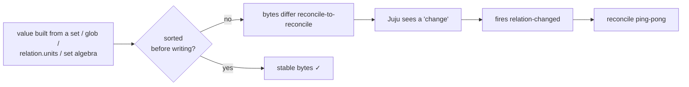
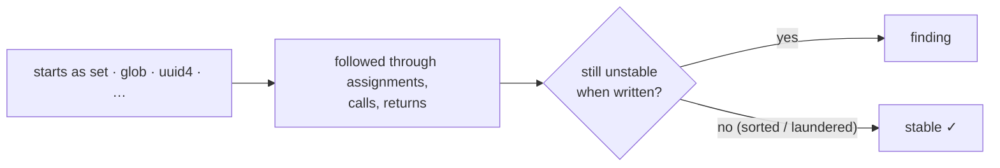

# flaplint


`flaplint` is a static analyser for Juju charms. It reads your charm's source code and flags every place a value that has no stable byte-order — a set, a glob, a uuid4(), … — reaches a churn-sensitive write: a relation databag, an on-disk file, a pebble plan, or a content-hash change-detector.

---

## The bug it hunts

Charms talk through relation databags. Juju has one rule that makes ordering matter:

> Juju notifies the other side only when the **text** of a databag value changes.

It compares bytes, not meaning. So if your charm serialises a `set` (or a `dict`/list *built from* a set, a `glob`, `os.listdir`, set algebra, …) without sorting, the bytes come out in a different order each hook:

```json
["alice", "bob"]      (reconcile 1)
["bob", "alice"]      (reconcile 2)
```

Juju sees a "change", wakes the remote charm with `relation-changed`, it rewrites *its* databag in a new order, wakes you back… and two charms ping-pong forever. The fix is almost always one word:

```python
json.dumps(sorted(datasources, key=lambda d: d["uid"]))   # ← sorted()
```

The same problem appears everywhere a charm writes something that's compared byte-for-byte to detect change: a rendered config file, a pebble plan, a content hash. All four are sinks `flaplint` checks.



### Why read the source instead of running it?

The bug is a *latent* property of the code: a value's order is unstable whether or not a test ever exercises that relation. Reading the source means every code path is in scope, including the branches and error handlers a test suite never drives.

The trade-off is honesty about uncertainty. When where a value really came from can't be traced, the tool says so: it ranks findings by confidence and leaves the final call to you.

---

## What it catches (examples)

flaplint groups instability into four families. Each needs a different fix.

### 1. Unordered dict keys written directly

```python
config = {u.name: u.app.name for u in relation.units}   # dict — key order not fixed
databag["config"] = json.dumps(config)                    # key order varies each reconcile
```

**Fix:** `json.dumps(config, sort_keys=True)` — or `yaml.dump(config)`.

A key-sorting serializer works here because the *entire* disorder is in the dict's key order. Locking keys alphabetically makes the output identical every reconcile.

### 2. List built from an unordered source

The critical difference from #1: **once you convert a set to a list, the disorder moves from key order into element positions** — and key-sorting is blind to element positions.

```python
addrs = list(self.endpoints)                        # set → list: element order baked in
databag["addrs"] = json.dumps(addrs)                # even sort_keys=True can't fix list order
```

**Fix:** `list(sorted(self.endpoints))` — sort *before* materialising the list.

This is the most easily missed case. `json.dumps(addrs, sort_keys=True)` sorts the dict *keys* but does nothing to the order of items inside a list. `yaml.dump` has the same blind spot. So a list built from an unordered source keeps flapping even through a key-sorting serializer.

The same pattern appears as a join: `",".join(some_set)` bakes the set's order into a string, which no serializer can then reorder.

### 3. Nondeterministic value

```python
databag["nonce"] = str(uuid4())    # different on every reconcile — sorting can't help
```

**Fix:** Derive it deterministically, or persist it once and reuse it.

### 4. A helper that trusts its caller

```python
def publish(self, relation, items):               # items: no type hint
    relation.data[self.app]["peers"] = json.dumps(items)   # writes items unsorted
```

flaplint flags this as a helper that trusts its caller to pass ordered data. If you call `publish(relation, set_of_peers)` elsewhere, it emits a higher-confidence finding at the call site.

---

## How to use it

Install and a `flaplint` command is put on your `PATH`:

```bash
uv pip install -e .       # or: pip install -e .
```

```bash
# the common case: scan a charm's src/ (its sibling lib/ is auto-included).
# Dependencies are resolved automatically: flaplint finds the charm's own
# environment (a sibling .venv's bin/python, else its site-packages) and traces
# the deps that write relation data — no flags needed.
flaplint /path/to/my-charm/src

# scan a checked-out library source tree as well, and report on it
flaplint my-charm/src --dep ../cos-lib/src

# fast, own-code-only run (skip dependency resolution) — e.g. a CI gate
flaplint my-charm/src --no-deps

# point at a specific environment instead of the auto-picked sibling .venv
flaplint my-charm/src --python /path/to/other/.venv/bin/python

# trace dependencies but don't report findings inside them (resolution only)
flaplint my-charm/src --no-report-deps

# CI gate: only surface the confident findings, machine-readable
flaplint my-charm/src --min-confidence high --json

# list writes flaplint could see but couldn't fully trace (a worklist for manual review)
flaplint my-charm/src --explain-gaps
```

Also importable as a library:

```python
from flaplint import analyze_paths

findings = analyze_paths(["my-charm/src"], min_confidence="high")
for f in findings:
    print(f.format())
```

**Exit code** is `1` when any finding survives the confidence threshold, `0` when clean.

### Flags

| Flag | Meaning |
|------|---------|
| `paths…` | charm source files or directories to scan and report on |
| `--dep PATH` | extra source root to analyse and report on (e.g. a vendored lib) |
| `--venv PATH` | virtualenv / `site-packages` to trace into for call resolution only |
| `--python PATH` | resolve the charm's deps through a *specific* interpreter's import system (e.g. a `uv sync` `.venv`'s `bin/python`); namespace-package-aware, *installs nothing*. **A sibling `.venv`'s `bin/python` is auto-picked by default** — pass this only to override |
| `--no-deps` | disable automatic dependency resolution; scan only the charm's own `src/` and sibling `lib/` (fast, own-code-only — e.g. a CI gate, or when no venv is present) |
| `--no-report-deps` | trace installed dependencies for call resolution but do **not** report findings inside them (default: dependency findings *are* shown, as non-blocking warnings; a charm's own vendored `lib/` is always reported) |
| `--min-confidence {low,medium,high}` | reporting threshold (default `medium`) |
| `--sort {criticality,location}` | finding order: most important first (yours before dependencies, higher confidence first), or by file location (default `criticality`) |
| `--format {pretty,concise,json}` | output style: grouped colour report (`pretty`, default), one-line-per-finding for editors/grep (`concise`), or machine `json` |
| `--json` | alias for `--format json` |
| `--explain-gaps` | also list **blind spots**: writes whose content flaplint couldn't fully trace (an unresolved library call, a value-object field, an untraced parameter). Not findings, never fail the run — a worklist of where a missed flap could hide |

> Colour in `pretty` mode is emitted only to a terminal; it auto-disables when piped or in CI, and honours the `NO_COLOR` / `FORCE_COLOR` conventions.

> For how automatic resolution, `--venv` and `--python` discover vendored vs. installed libraries, see [Resolving charm dependencies](docs/resolving-dependencies.md).

### Silencing a known-good line

If a list's order is genuinely meaningful, annotate it:

```python
relation.data[self.app]["priorities"] = json.dumps(items)  # databag-order: ignore
```

---

## How it works

`flaplint` marks values where they're *created* as unstable, follows them forward through assignments and function calls, and reports a problem when they reach one of four write targets while still unstable.



The four write targets:

| sink | why it matters |
|---|---|
| **databag** | `relation.data[app][key] = …` — byte differences trigger spurious `relation-changed` |
| **file** | `container.push(path, …)` — a reshuffled config forces unnecessary rerenders/restarts |
| **pebble plan** | `container.add_layer(…)` — a changed plan triggers `replan()` and a workload restart |
| **hash** | `sha256(content)` — a different hash fires the change-gate every reconcile |

For the full story — every pattern it catches, how each serializer treats them, what gets followed through function calls, and where the analysis has blind spots — see **[docs/](docs/README.md)**.

---

## Reading the output

By default `flaplint` prints a **grouped, colourised report**:

```text
flaplint

src/charm.py
  ✖  142:9  unordered collection · peers → databag  · high confidence
            `peers` is an unordered collection written to the relation databag.
            Fix at the source: the instability is created upstream in `_collect()`
            (src/utils.py:20).
  ✖  51:13  nondeterministic value · uuid4 → databag  · high confidence
            `uuid4` is freshly generated each time this code runs, so the value written
            differs from last time (sorting cannot fix it).

lib/charms/grafana_k8s/v0/grafana_dashboard.py
  ▲ 1359:9  nondeterministic value · stored_data → databag  · high confidence
            `stored_data` is freshly generated each time this code runs …

────────────────────────────────────────────────────────
  ✖ 3 flap risk(s)   2 yours   1 in dependencies   · 11 file(s) scanned
```

Every finding carries **two independent axes**, spelled out so neither is mistaken for the other:

| Axis | What it answers | How it shows |
|------|-----------------|--------------|
| **ownership** | *whose job is the fix?* | the `✖` **yours** / `▲` **in a dependency** mark, the footer legend, and the total (`2 yours`) tally |
| **confidence** | *how sure is flaplint it's a real flap?* | `high` / `medium` / `low`, in the header tail |

They're orthogonal: a `▲` finding can be `high confidence` (a real flap, but in a library you don't own) and a `✖` can be `medium`. Each finding's header line reads `mark line:col  <failure mode> · <variable> → <sink>  · <confidence>`; then the indented plain-English *why* and *fix*, with a `Fix at the source …` trail when the value is born elsewhere.

- `line:col` — **where to fix it** (for `unordered-pick` this is the pick itself, not the blameless serialiser)
- `· <variable>` — the **affected identifier** to look at (`peers`, `scheduler_addrs`, `uuid4`)
- `→ <sink>` — where the value lands: `databag`, `file`, `plan`, `hash`, or `render`

### Machine-readable / editor output

For editors, `grep`, or scripts, `--format concise` emits one flat line per finding (and `--json` emits the structured records). The two axes are separate greppable fields — `owner=yours|dependency` and `confidence=high|medium|low`:

```text
src/charm.py:142:9: owner=yours type=unordered-collection confidence=high sink=databag var=peers
src/coordinator.py:229:42: owner=yours type=unordered-pick confidence=high sink=file var=scheduler_addrs
src/charm.py:51:13: owner=yours type=nondeterministic confidence=high sink=databag var=uuid4
lib/charms/grafana_k8s/v0/grafana_dashboard.py:1359:9: owner=dependency type=nondeterministic confidence=high sink=databag var=stored_data
```

### The four problem types

| `type=` | what went wrong | the fix |
|---------|------------|---------|
| `unordered-collection` | a whole `set`/`dict` serialised unsorted | `sorted(...)` / `sort_keys=True` |
| `unordered-pick` | one item chosen by **position** (`addrs[0]`) | `sorted(addrs)[0]` |
| `unordered-iteration` | a **list built from something unordered** (`list(some_set)` / `[… for … in …]`) | `sorted(...)` before the list |
| `nondeterministic` | a **different-every-run** value (`uuid4()`/`time()`) | make it stable/persistent |

`kind=caller` means the bug is right here in your code. `kind=sink` means a helper function that writes a *parameter* unsorted — it trusts its caller to pass ordered data. See [sinks-and-findings.md](docs/sinks-and-findings.md) for the full grading rules.

### Ownership — whose job is the fix?

The blocking axis is about **responsibility**, not severity (that's what `confidence` is for). A `✖` **yours** finding is code the charm owns — its `src/` or its own `lib/charms/<charm-name>/` namespace; these fail the run. A `▲` **in a dependency** finding lives in a library the charm only *uses*: shown for awareness, but never fails the run — you can't fix someone else's library here. A dependency finding can still be `high confidence`; it just isn't yours to fix.
