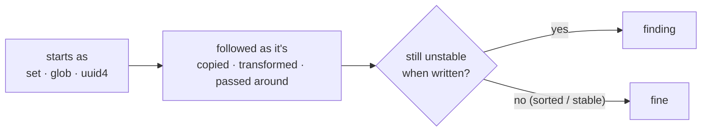
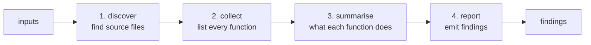
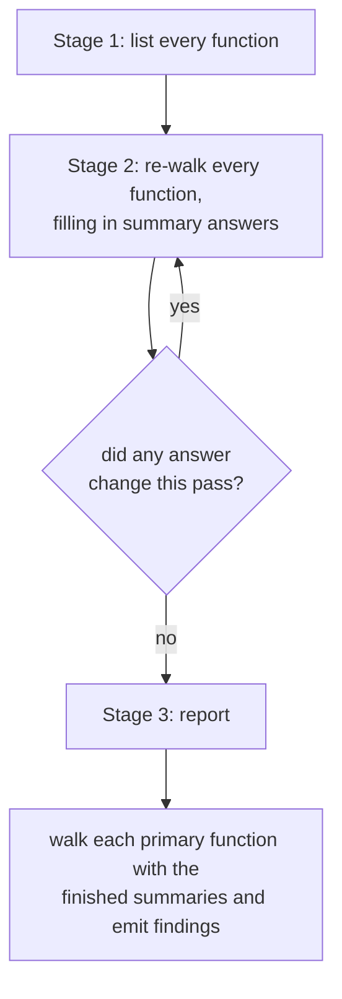
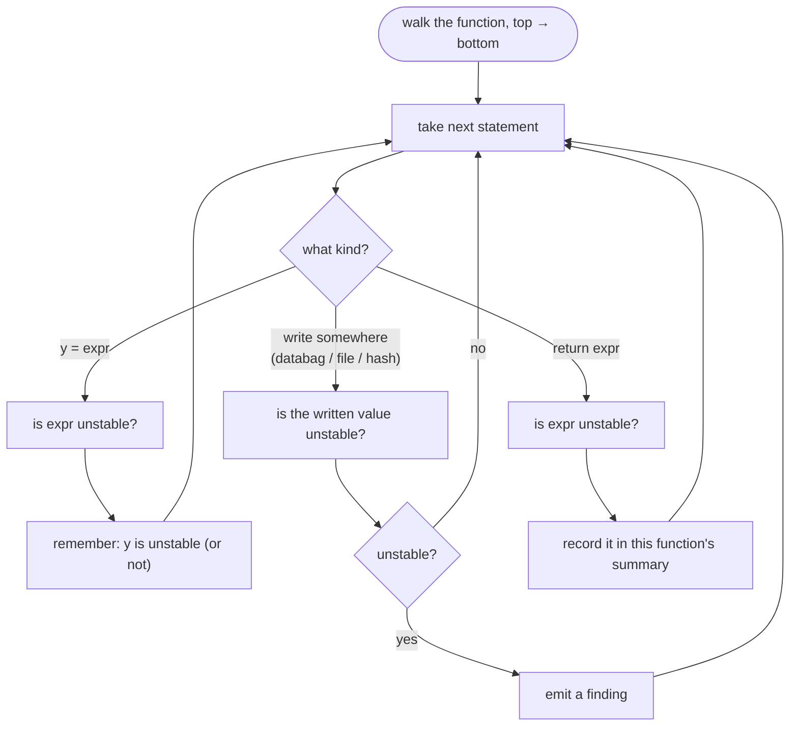
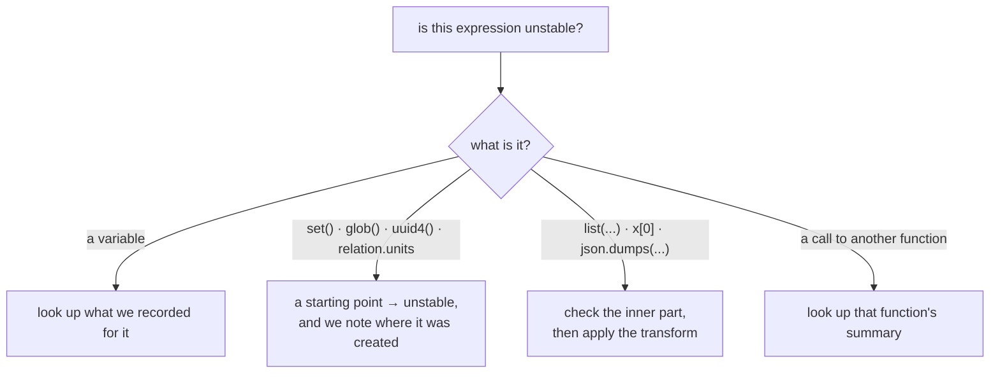

# Architecture

How `flaplint` is built and how a run flows through it. Read this first if you want to
change the tool; read [taint-model.md](taint-model.md) and
[sinks-and-findings.md](sinks-and-findings.md) for the analysis details.

## The idea

`flaplint` follows values from where they're created to where they're written, and
reports the ones that are still unstable when they get written. Three parts:

- **Where values start** — here, values with no fixed text order, like a `set`, a
  directory listing, or a `uuid4()`.
- **Following them** — watching each value as it's copied, transformed, and passed
  around.
- **Where they land** — the places that cause trouble: a relation databag, a file, a
  pebble plan, or a content hash.

flaplint marks a value where it starts, follows it, and reports a problem when it
reaches one of those places while still unstable.



What counts as a starting point, and how following changes a value, is the subject of
[taint-model.md](taint-model.md); where values land is in
[sinks-and-findings.md](sinks-and-findings.md).

One thing shapes the whole design: a value is usually *created* in one function and
*written* in another. So flaplint also works out, for each function, what it does to
the values passing through it — and reuses that instead of re-reading the function on
every call. That is the [summary loop](#following-values-across-function-calls), and
it's the bulk of this document.

## The pipeline

A run is four stages, driven in order by `analyzer.py` (the part that ties it all
together). The first three build up knowledge; the last turns it into findings.



1. **Discover** — turn the inputs into a list of source files: the charm's `src/`, its
   sibling `lib/`, any `--dep` roots, and (only to understand calls) installed
   dependencies. Files split into **primary** (we report on these) and **secondary**
   (we only read them to understand calls). See
   [resolving-dependencies.md](resolving-dependencies.md).
2. **Collect** — read each file once and make a list of every function and method,
   with its parameters, type hints, and class.
3. **Summarise** — walk every function over and over until the answers stop changing.
   See [Following values across function calls](#following-values-across-function-calls).
4. **Report** — a final walk over the primary functions, now with complete summaries,
   turning each "unstable value reaches a write" into a finding. See
   [sinks-and-findings.md](sinks-and-findings.md).

## Module map

| Module | What it does |
|--------|----------------|
| `constants.py` | the lists of known names — sources, sanitisers, serializers, write shapes |
| `model.py` | the core data types — a finding, a function's summary, an instability label |
| `astutils.py` | small helpers for reading the syntax tree |
| `taint.py` | given one expression, is it unstable, and why? ([taint-model.md](taint-model.md)) |
| `databag.py` | given one expression, is it a relation databag, and how? — traces Relation → its data → a databag |
| `traversal.py` | walk one function's statements and follow unstable values to where they're written |
| `handlers.py` | what to do when an unstable value reaches a write or a return |
| `summary.py` | the walk-until-nothing-changes loop |
| `report.py` | turn summaries into final findings |
| `collector.py` | list every function |
| `discovery.py` | find and read source files; resolve dependencies |
| `analyzer.py` | tie it all together; the public API |
| `cli.py` | the `flaplint` command |

The analysis itself is just two of these. `taint.py` looks at a single expression and
says whether it's unstable. `traversal.py` walks a whole function top to bottom, asking
`taint.py` about each expression as it goes, and acting when an unstable value reaches a
write. Everything else is plumbing: finding files, listing functions, running the loop,
and formatting output.

## Following values across function calls

A finding always has the same shape: an unstable value reaches a write. The catch is
that the value is usually *created* in one function and *written* in another — your
charm builds a `set`, hands it to a library helper, and that helper writes it to a
databag a few calls away. To connect the two, flaplint needs to know what each function
does to the values passing through it — without re-reading that function every time
it's called.

That knowledge is a **summary**: a few facts stored on each function, answering a fixed
list of questions.

### The questions a summary answers

Imagine the report stage looking at a function and seeing it call `helper(x)`. To
decide whether that call is a bug, it has to already know how `helper` treats what's
passed in and what comes back out. So for every function, the summary answers:

1. **If I pass an unstable value as your Nth argument, do you write it somewhere
   without sorting?** If yes, then a caller that hands in an unordered value at that
   position has a bug at the call. This is what lets a `json.dumps(x)` deep inside a
   library point the finger at the charm code that built `x`.

2. **Is the value you return unstable — and in what way?** A caller that does
   `y = helper(); write(y)` is only safe if the return value is stable. The *in what
   way* matters because the fix differs: a returned bare `set` is made safe by a
   key-sorting serializer, but a returned `list(set)` is not.

3. **If I pass an unstable value in, does it come back out through your return?** Some
   helpers just pass things through (`return transform(arg)`). If the argument's
   instability survives to the return, then `helper(messy)` is still messy.

4. **Do you loop one of your parameters into a list without sorting it?** Here the
   helper can't see whether its callers pass ordered data, but the loop is exactly
   where a `sorted()` would go — so that's where a finding should point.

Answer those for every function and the report stage never has to re-analyse a callee.
It just looks up the answers.

### Why it has to be a loop

The answers depend on each other. To answer question 1 for function `A`, you often need
to know whether the helper `A` calls is *itself* unsafe — the answers for `B`. And `B`
might call `C`, which might call back into `A`. There's no order to visit the functions
in that finishes every callee before its caller.

So flaplint just repeats. It walks every function, fills in whatever answers it can from
what's known so far, and goes around again. Each pass can only *add* facts, never remove
them, so the answers keep growing until a full pass adds nothing new. At that point
every summary is complete — and the result doesn't depend on the order the files were
read in (more on that in [Design notes](#design-notes--limitations)).



### Zooming in: walking one function

Both the summary stage and the report stage walk one function at a time the same way;
they differ only in what they do when an unstable value reaches a write (record a fact,
or emit a finding). Here is that single walk:



The walk goes **forward**, top to bottom, keeping a running note of which local
variables are unstable and why. Each assignment checks its right-hand side and records
the result, so by the time the walk reaches a later line it already knows the state of
every variable in scope.

Checking whether one expression is unstable means looking at it and working down to its
parts, which bottom out at one of four things:



### How a finding points back at the source

This part is easy to misread, so to be clear: **there is no separate backward pass from
the write to the source.** When the walk reaches a write, it checks the value being
written. That value's variables resolve to what was recorded for them earlier in the
walk — and each unstable value remembers *where it was created*. The finding simply
reports that location. Nothing walks backward; the "where it came from" information
travelled forward with the value.

Trace this function:

```python
def publish(self, route):
    group_by = set(route.get("group_by", []))                       # 1
    group_by = list(group_by)                                       # 2
    self.relation.data[self.app]["g"] = yaml.safe_dump({"x": group_by})  # 3
```

| line | what the walk does | what we know about `group_by` |
|---|---|---|
| 1 | a `set(...)` is a starting point → unstable, created here | unstable (a set), from line 1 |
| 2 | `list(group_by)` turns the set into a list — the kind of instability sorting-the-keys can't fix — still tagged as created at line 2 | unstable (a list), from line 2 |
| 3 | a databag write. The written value contains `group_by`, which is unstable; `yaml.safe_dump` sorts keys but can't reorder the list — so it stays unstable → **finding, pointing at line 2** | — |

The finding lands on line 2 (the `list(...)`, where `sorted()` belongs), not line 3
(the serializer), because the value remembered it was created on line 2.

The only difference across functions is the last box in the second diagram: if the
written value is `helper(group_by)` instead of a local variable, the walk looks up
`helper`'s summary instead of a local note. Same forward walk — the summaries are what
let it reach across a call.

### What a summary records

The four answers are stored on each function as these fields:

| field | the question it answers |
|---|---|
| `dangerous` | Q1 — which parameters get written somewhere unsorted |
| `returns_unordered`, `returns_element`, `returns_itercaller` | Q2 — the return value is unstable, and which kind |
| `returns_params` | Q3 — which parameters flow back out through the return |
| `iter_params` | Q4 — which parameters get looped into a list without sorting |

The kinds of instability these refer to (`local`, `element`, `itercaller`, …) are
explained in [taint-model.md](taint-model.md); how they turn into `caller` vs `sink`
findings is in [sinks-and-findings.md](sinks-and-findings.md).

## A worked example

```python
# lib/charms/foo/v0/foo.py
class Provider:
    def publish(self, relation, items):                         # 'items' has no type hint
        relation.data[self.app]["peers"] = json.dumps(items)    # ← write

# src/charm.py
def _on_changed(self, event):
    peers = {u.name for u in self.model.relations["foo"]}        # a set → starting point
    Provider().publish(event.relation, peers)                   # passes the set in
```

- **Collect** lists `Provider.publish` and `_on_changed`.
- **Summarise** walks `publish`: its `items` parameter is written straight into a
  databag without sorting, so the summary records that parameter as dangerous.
- **Report** walks `_on_changed`: `peers` is a set (unstable). The call to `publish`
  passes it into the dangerous parameter, so it emits a finding at the call line (a real
  bug you own), plus a lower-confidence finding inside `foo.py` (the helper trusts its
  callers to pass ordered data).
- The fix is one word: `sorted(peers)` at the call, or sort inside `publish`.

## What the analysis anchors on

It's worth being clear about what flaplint depends on, because that tells you where it's
solid and where it can drift. The design deliberately separates a **library-agnostic
core** from a **small, listed edge** that touches the charm ecosystem.

**The core knows nothing about charms.** The engine — the instability labels, the
forward walk, the summaries, the reasoning about what sorting fixes — is built on the
Python language and one general fact about ordering: a set has no fixed order, and
sorting keys fixes dict-key order but not list order. This would run on any Python
codebase. It never changes when the charm ecosystem changes.

**Starting points and following are language and standard library.** Sets, set math,
and comprehensions are the language itself. `glob`, `listdir`, `uuid4`, `time`,
`sorted`, `list`, `json.dumps`, and `sort_keys=True` are standard-library names that
have been stable for years.

**Only a small edge is tied to the charm world** — a handful of ops/pebble shapes and
names:

| anchor | what flaplint uses it for | how it's matched |
|---|---|---|
| `model.get_relation(...)` | produces a **Relation** (where "this is a databag" starts) | method name (ops Model API) |
| `<relation>.data[app \| unit]` | the databag itself | by shape |
| `.update()`/`.setdefault()`/`[k]=`, `relation.save(...)` | databag writes | shape + name |
| `relation.units` | an unordered source | attribute name |
| `container.push` | file write (compared character-for-character) | method name |
| `container.add_layer` | pebble plan write (compared by structure) | method name |
| `.render(...)` | a Jinja template render | method name (a best guess) |

flaplint recognises a databag by **tracing where it came from**, not by one fixed shape:
a Relation comes from `get_relation(...)`; `.data` on something *already known to be a
Relation* is its mapping; indexing that by an `app`/`unit` is a databag — and a write to
that databag is caught however many property hops wrap it (see
[databag.py](../src/flaplint/databag.py) and
[sinks-and-findings.md](sinks-and-findings.md#databag--writing-to-relation-data)).
Crucially, `.data` only counts on something *already known to be a Relation*, so a bare
`.data` on anything else is never mistaken for a databag — and no type name (`Relation`)
is matched, so an unrelated same-named class can't fool it.

The names live in `constants.py`, the shapes in `astutils.py`, and the
trace-where-it-came-from logic in `databag.py`. Adding a new write target or source is a
small, local change there, with no change to the engine.

**Renamed imports are handled, so the name matching isn't fooled by aliases.** Matching
is on the *name a call actually uses*, so on its own an `as` rename would hide a known
source or serializer (`from uuid import uuid4 as gen` → `gen()`). To prevent that, the
collector records each file's import aliases and the engine turns the used name back into
its real one before matching — so `gen()` is treated as `uuid4`, and `import json as j`
→ `j.dumps` as `dumps`. (One narrow case is left: a module alias on the `os.write`
disambiguation, `import os as o` → `o.write`, because that check lives in a pure helper
rather than the engine. It's rare and fails toward a missed write, not a false alarm.)

**It is not tied to how a charm is wired.** There are no provider/requirer class names,
relation names, or charm-library names anywhere in the engine. It matches the *general
shape* of "write into relation data" and "build or serialise an unordered value", which
is why the same rules find issues in charms that share no code and are wired completely
differently.

**There is no version lockstep with ops.** flaplint never imports ops or runs a charm —
it reads source as text. A charm written against any ops version is analysed the same,
as long as it uses the same shapes (`relation.data[...]`, `relation.units`,
`container.push`), which ops has kept stable across releases. The link is to the API
*surface*, updated by hand, not to a pinned version.

**Drift fails safe, but quietly.** If ops renamed one of these, or the ecosystem
invented a new write shape flaplint doesn't know, the result is a *missed* write — a
false negative — not a crash or a false alarm. That's the gentler failure, but it's
quiet: you wouldn't notice coverage had dropped. To make it loud,
`tests/test_api_anchors.py` checks that each ops/pebble anchor still exists; if a
dependency bump removes or renames one, that test fails and points at the anchor to
update. (The real maintenance task isn't ops renaming stable things — it's adding new
write shapes as the ecosystem introduces them.)

## Design notes & limitations

A few things about the design are worth understanding.

### Processing order doesn't change the result

The order functions are summarised in (which follows the order files are read) does
**not** change the final output. The walk-until-nothing-changes loop guarantees it,
because each pass only ever *adds* facts, never removes one. Repeating that kind of
update until nothing changes always lands on the same answer, whatever order the updates
happen in.

Order only changes **how many passes** it takes. If `A` calls `B` and `A` is walked
first, `A`'s summary comes out incomplete that pass and gets completed the next pass,
once `B` is known. Walking callees before callers settles faster, but flaplint doesn't
bother trying to find a good order (impossible anyway when calls form a cycle,
`A`→`B`→`C`→`A`) — it just repeats until a pass changes nothing.

### Why the analysis runs forward, not backward

A fair question: instead of following values *forward* from where they're created, why
not start at each write and walk *backward* to find what feeds it? A backward search can
be faster on a very large codebase, because it only looks at code that reaches a write
and ignores the rest. Here it wouldn't help:

- **The codebase is small.** A charm scans in well under a second, so the work a
  backward search would skip is tiny — not worth a more complicated design.
- **Forward already avoids the re-work.** Each function's summary records "if you pass
  me an unstable argument, does it reach a write?" — worked out once and looked up at
  every call, never recomputed. That's the same saving a backward search is meant to
  give.
- **Forward fits the actual question.** The job isn't only "does a source reach a
  write", it's *what kind* of instability it is and whether a serializer along the way
  fixes it. Those facts start at the source and change step by step as the value moves
  forward. Going backward you'd reach the serializer first and have to undo those steps
  in reverse, which they don't cleanly allow.
- **Direction wouldn't avoid the loop.** Because calls can form cycles, you'd still need
  the same walk-until-nothing-changes loop either way.

So forward is simpler here and loses nothing that matters at this scale.

### Following values through object fields (and where it stops)

flaplint follows values it can see directly — local variables, arguments, return
values — and, for **value objects** (dataclasses, pydantic models, NamedTuples),
through a *one-level field*. An unstable collection stashed in a field and read back
survives:

```python
# followed
x = set(); y = list(x); push(json.dumps(y))           # within a function
def h(a): return list(a);  push(h(some_set))          # across functions, via the return
ctx = Ctx(targets=set(x)); push(",".join(ctx.targets))    # stored in a field, read back
ctx = self._build(); push(",".join(ctx.targets))         # field carried by the return summary
```

Field tracking handles **each field separately** — a clean field of a partly-unstable
object isn't flagged — and is stored as a combined name (`"ctx.targets"`). It covers
construction (`Ctx(field=…)`), a field write (`ctx.field = …`), a simple alias
(`a = ctx`), and the across-function return (`returns_field_origins`).

What it still does **not** follow:

```python
# NOT followed
self.cfg = {"jobs": list(some_set)}                   # the unstable value is buried in a dict first
push(json.dumps(self.render()))                       # …a method rebuilds it later
a.b.c = set(x)                                         # deeper than one level
```

The remaining real-world miss is a value *buried in a dict* before being stored, or one
*rebuilt by a method* of the object rather than read straight off a field (the cos-proxy
`ScrapeJobContext` shape). And when the consumer is a library you don't analyse that
reads the field and writes the bag itself, the value reaches the boundary but has no
in-repo write to pin a finding to.

This is a limit of what flaplint models, not of which direction it runs: a "start at the
write and walk back" design would hit the same wall — it would still need to model
values flowing through dict entries and method-rebuilt object state.

### A "trusts its caller" finding lands on the direct writer, not on forwarders

When a function writes one of its *parameters* somewhere, it gets a just-in-case
[trusts-its-caller finding](sinks-and-findings.md#when-a-helper-trusts-its-caller)
graded by that parameter's type hint. But this only applies to the function that does
the write **directly**. A function that merely passes a parameter *along* to another
writer doesn't get its own finding.

That means the finding lands on whichever helper does the actual write — often a generic
one (a `write_to_file(content)` / `set_data(data)`), where the parameter has no hint —
rather than on the caller that gave the value a meaningful hint
(`enabled_log_files: Iterable`). So a precise, high-confidence finding on the hinted
parameter several calls up isn't produced. Surfacing it would mean flagging every
forwarded parameter, which would be far too noisy, so the tool deliberately doesn't.
(These trusts-its-caller findings also cover databag writes only, not file or hash
writes.)
