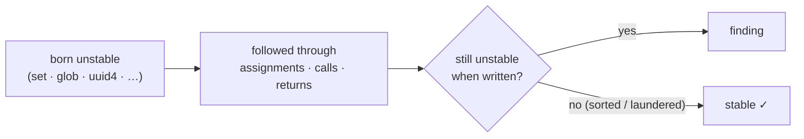
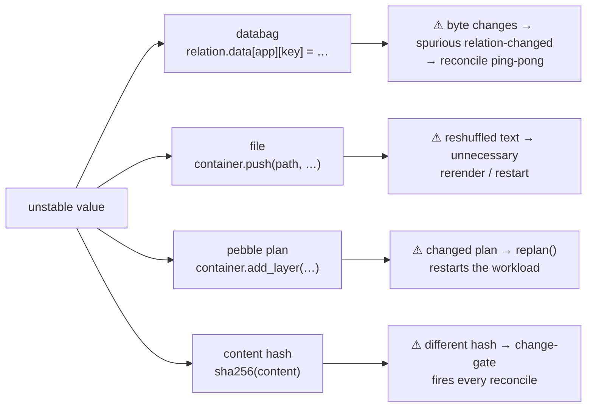
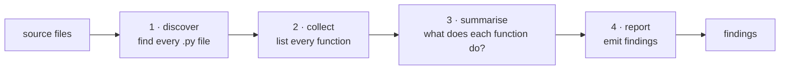
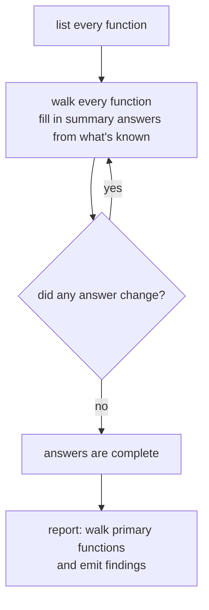

# How flaplint works

A high-level walkthrough of what happens during a run and how the analysis is structured. For what flaplint *detects*, see [taint-model.md](taint-model.md). For the four write targets and how findings are graded, see [sinks-and-findings.md](sinks-and-findings.md).

## The idea

flaplint follows values from where they're **created** to where they're **written**, and flags the ones that are still unstable when they get there. Three moving parts:

- **Sources** — where instability enters: `set(...)`, `glob(...)`, `uuid4()`, `relation.units`, ...
- **Propagation** — how it moves: through assignments, function calls, return values, and object fields.
- **Sinks** — where it causes harm: one of four write targets.



## Background: this is taint analysis

flaplint's core analysis is a standard static-analysis technique called **taint analysis**: mark data from an untrusted **source**, follow it as it flows through the program, and raise an alarm if it reaches a dangerous **sink** without passing through a **sanitiser**. Classic taint analysis comes from security (source = user input; sink = SQL query; sanitiser = escaper). flaplint keeps that machinery and changes only what "tainted" *means*: here a value is tainted when it's **derived from an unordered or volatile source**. A `set` is a source, a databag is a sink, and `sorted()` is a sanitiser.

What's specific to flaplint is the **abstract domain** — not one bit (tainted/not) but [six labels](taint-model.md#the-six-kinds-of-instability) describing *why* a value is unstable, because the right fix differs by kind. In particular, whether letting a serializer sort the keys is enough to save you — or whether the disorder has already been baked into a list and can only be fixed by sorting before the list is built.


## The four sinks

When an unstable value reaches any of these, it's a finding:



Note: `file` writes are compared character-for-character (any instability matters), while `databag`, `plan`, and `hash` are compared structurally or key-first — so a bare `set` written to a plan may be harmless if pebble sorts it, but a `list(set)` is not. See [sinks-and-findings.md](sinks-and-findings.md#the-four-kinds-of-write-target) for how each sink interprets what it receives.

## The pipeline

A run is four stages, driven in order by `analyzer.py`:



1. **Discover** — turn the inputs into a list of Python files. Your charm's `src/` and its sibling `lib/` are scanned and reported on. Dependencies (installed packages, vendored libraries) are read to understand calls but findings inside them are only shown if you ask. See [resolving-dependencies.md](resolving-dependencies.md).
2. **Collect** — read each file once and record every function and method with its parameters and type hints.
3. **Summarise** — work out, for each function, what it does to unstable values. This stage repeats in a loop until the answers stop changing — see [The summary loop](#the-summary-loop) below.
4. **Report** — walk each primary function with the finished summaries and emit a finding wherever an unstable value reaches a sink.

## The summary loop

Stage 3 is the interesting part. The problem: to decide whether `helper(x)` in function `A` is safe, you need `helper`'s summary — but `helper` may call `A`, forming a cycle. There's no ordering that finishes every callee before its caller.

So flaplint repeats. It walks every function, fills in whatever answers it can from what's known so far, and goes around again. Each pass can only *add* facts, never remove them, so the answers keep growing until a full pass changes nothing — a **fixed point**. Order of visiting doesn't affect the final result, only how many passes it takes (usually two or three).



What the summary records for each function:

| question | what it enables |
|---|---|
| Does this function write any of its parameters without sorting? | A caller passing an unstable value into that parameter gets a `caller` finding at the call site |
| Does it return an unstable value, and which kind? | A caller that writes the return value is flagged |
| Does it pass any of its inputs straight back through the return? | The instability flavor travels with the return |
| Does it loop any of its parameters into a list? | A `sink` finding at the loop (helper trusts caller to pass ordered data) |

This is what makes cross-function tracing work: your charm builds a `set`, passes it to a library helper that writes it to a databag two calls away, and flaplint connects the two — one function at a time, by looking up summaries instead of re-analysing callees.

## A worked example

```python
# lib/charms/foo/v0/foo.py
class Provider:
    def publish(self, relation, items):                        # 'items' has no type hint
        relation.data[self.app]["peers"] = json.dumps(items)  # ← write

# src/charm.py
def _on_changed(self, event):
    peers = {u.name for u in self.model.relations["foo"]}      # a set → unstable
    Provider().publish(event.relation, peers)                  # passes the set in
```

- **Collect** lists `Provider.publish` and `_on_changed`.
- **Summarise** walks `publish`: `items` is written straight into a databag without sorting → records `items` as a dangerous parameter.
- **Report** walks `_on_changed`: `peers` is a set (unstable). The call to `publish` passes it into the dangerous parameter → emits a finding at the call line (`kind=caller`, high confidence) and a lower-confidence finding inside `foo.py` (`kind=sink` — the helper trusts its caller).
- The fix is one word: `sorted(peers)` at the call, or sort inside `publish`.


## What the analysis anchors on

It's worth being clear about what flaplint depends on, because that tells you where it's solid and where it can drift.

**The core knows nothing about charms.** The engine — the instability labels, the forward walk, the summaries, the reasoning about what sorting fixes — is built on the Python language. It would run on any Python codebase and never changes when the charm ecosystem changes.

**Starting points and serializers are standard library.** Sets, set math, and comprehensions are the language itself. `glob`, `listdir`, `uuid4`, `time`, `sorted`, `list`, `json.dumps`, and `sort_keys=True` are standard-library names that have been stable for years.

These are matched as **names in the source text**, so flaplint isn't bound to any Python version — a charm written for 3.8 or 3.12 is read the same. One *semantic* shift that matters — dicts becoming insertion-ordered in 3.7 — is already baked in, and every charm runs 3.8+. The residual risks are: a brand-new source or serializer would be missed (a false negative), and a charm method that happens to share a name with a stdlib function (`now`, `sample`, `choice`) could be mistaken for it (a rare false positive; renamed *imports* are resolved, but same-named methods can't be distinguished).

**Only a small edge is tied to the charm world:**

| anchor | what flaplint uses it for |
|---|---|
| `model.get_relation(...)` | produces a Relation (the only way "this is a databag" starts) |
| `<relation>.data[app\|unit]` | the databag itself |
| `.update()` / `.setdefault()` / `[k]=`, `relation.save(...)` | databag writes |
| `relation.units` | an unordered source |
| `container.push` | file write |
| `container.add_layer` | pebble plan write |
| `.render(...)` | a Jinja template render (best guess) |

flaplint recognises a databag by **tracing where it came from**, not by one fixed shape: a Relation comes from `get_relation(...)`; `.data` on something *already known to be a Relation* is its mapping; indexing that by an `app`/`unit` is a databag. So a write is caught even when it's wrapped several property hops deep — and `.data` on anything else is never mistaken for a databag.

**Renamed imports are handled.** Matching is on the *name a call actually uses*, so `from uuid import uuid4 as gen` would hide `gen()`. To prevent that, the collector records each file's import aliases and the engine resolves the real name before matching — so `gen()` is treated as `uuid4`, and `import json as j` → `j.dumps` as `dumps`.

**There is no version lockstep with ops.** flaplint never imports ops — it reads source as text. It matches the API *surface* (`relation.data[...]`, `relation.units`, `container.push`), which ops has kept stable across releases. See [ops-version-anchoring.md](ops-version-anchoring.md) for how drift is caught.

## Design decisions

### Why the analysis runs forward, not backward

A backward search would start at each sink and walk toward the sources that feed it, potentially skipping functions that don't reach any sink. There are four reasons forward was chosen instead:

- **The codebase is small.** A charm scans in well under a second. The code a backward pass would skip is not worth a more complex design.
- **Forward already avoids re-work.** Each function's summary records "if you pass me an unstable argument, does it reach a sink?" — computed once and looked up at every call, never recomputed. That's the same savings a backward search buys.
- **Forward fits the actual question.** The job isn't just "does a source reach a sink" — it's *what kind* of instability and whether a serializer along the way fixes it. Those facts start at the source and change step by step as the value moves forward. Going backward, you'd reach the serializer first and have to undo its effects in reverse, which the analysis can't cleanly do.
- **Direction doesn't remove the loop.** Because calls can form cycles, you'd still need the same repeat-until-settled loop either way. The complexity saving doesn't materialise.

### Processing order doesn't change the result

The order functions are summarised (which follows the order files are read) does **not** change the final output. The fixed-point loop guarantees it, because each pass only ever *adds* facts — never removes one. Repeating that kind of update until nothing changes always lands on the same answer regardless of order.

Order only changes **how many passes** it takes. If `A` calls `B` and `A` is walked first, `A`'s summary is incomplete that pass and gets completed the next pass, once `B` is known. The analyzer doesn't try to find a good visiting order (impossible when calls form a cycle, `A`→`B`→`C`→`A`) — it just repeats until a pass changes nothing.

### Contract-boundary findings land on the direct writer, not on forwarders

When a function writes one of its *parameters* to a sink, it gets a `kind=sink` finding graded by that parameter's annotation. But this only applies to the function that writes to the sink **directly**. A function that merely passes a parameter *along* to another writer does not get its own finding.

That means the finding lands on whichever helper does the actual write — often a generic one (`write_to_file(content)`, `set_data(data)`) where the parameter is unannotated — rather than on the caller that gave the value a meaningful annotation (`enabled_log_files: Iterable`). So a precise, high-confidence finding on the well-annotated parameter several calls up isn't produced. Surfacing it would mean flagging every forwarded parameter, which would be far too noisy, so the tool deliberately doesn't.

## Known gaps

flaplint follows values it can see directly — local variables, function arguments, return values, and (one level deep) object fields. Here are the patterns it misses.

### A value rebuilt by a method

```python
# tracked: self._hosts assigned and returned directly
def __init__(self): self._hosts = set(self.peers)
def reconcile(self): push(",".join(self._hosts))   # ← caught

# NOT tracked: a method rebuilds from internal state
def reconcile(self): push(",".join(self._render()))  # _render() builds from self._hosts internally
```

flaplint sees `_render()` return something but can't trace what it rebuilds from. If the method returned `self._hosts` directly it would be caught.

The same limit hides a **config-builder object** that accumulates components and is dumped elsewhere: `self.config.add_component(name, {…})` stores the value under `self._config[section][name]` (a nested-subscript instance attribute flaplint doesn't track), and a separate `build()` re-serializes the whole thing with `yaml.safe_dump`. Two things break the chain, so a value handed to `add_component` isn't followed to the dump: the nested-subscript instance-attr write isn't tracked, and the value usually enters as a *field* of a loop variable (`endpoint["url"]` in `for i, endpoint in enumerate(endpoints)`), which flaplint's field-sensitive fixed-key lookup treats as its own slot rather than inheriting the positional instability of `endpoint`. The instability *arriving* at the builder is still caught at its source (e.g. a set enumerated into `.../{idx}` component names is flagged at the `enumerate`, before the `add_component` call), and a helper that passes a *whole* unstable parameter straight into the config (`config={"scrape_configs": jobs}`) is followed normally.

### A value reached through a call or subscript in the field chain

```python
self.ctx.config.targets = set(x)   # ← caught (a pure attribute chain, any depth)
self.get_ctx().targets = set(x)    # ← NOT caught (a call breaks the chain)
self.items[0].targets = set(x)     # ← NOT caught (a subscript breaks the chain)
```

Field taint is tracked along a pure attribute chain rooted at a name, to any depth
(`self.ctx.config.targets` is followed both within a method and across methods). But
a link that goes through a call or an index isn't a stable slot flaplint can name, so
the chain stops being tracked there — the value effectively becomes "rebuilt by a
method" (the gap above).

### A cross-object call through an *untyped* member

```python
class Manager:
    def __init__(self, charm: "MyCharm"):   # ← annotated: self.charm resolves
        self.charm = charm
    def go(self): push(",".join(self.charm.peer_ips))   # ← caught

class Cluster:
    def __init__(self, charm):              # ← no annotation: self.charm is opaque
        self.charm = charm
    def go(self): push(",".join(self.charm.peer_ips))   # ← NOT caught
```

A member chain of any depth (`self.charm.replication.get_addrs()`) resolves its
receiver one hop at a time, as long as **every** intermediate attribute's class is
known — from a constructor assignment (`self.x = ClassName(...)`) or a *class-annotated*
back-reference (`self.charm = charm` where `charm: MyCharm`). The near-universal
`self.charm` back-reference is the usual first hop, so annotating it is what lets a
manager reach back into the charm's accessors. An **unannotated** back-reference leaves
that hop opaque and the chain stops there — the value becomes "rebuilt by a method". (A
uniquely-named method still resolves by name regardless, so this only bites when the
receiver's *type* is the only way to pick the right same-named method or property.)

### A value looked up by a variable key

```python
cfg["peers"] = set(x)         # ← caught (constant key "peers" is tracked)
cfg[key] = set(x)             # ← NOT caught (variable key — can't know which slot)
```

### A model whose base class isn't a direct `BaseModel`


```python
class _Base(BaseModel): ...
class Cfg(_Base):           # ← indirect base — not recognised as a coercing model
    hosts: list[str]
cfg = Cfg(hosts=some_set)   # the set→list promotion is missed at this path
```

An intermediate project base class (`class Cfg(_Base)` where `_Base(BaseModel)`) isn't
followed transitively, so the field's coercion isn't known. The common direct-subclass
shape is covered.

### A finding for a forwarded parameter lands on the writer, not the typed caller

When a function writes one of its parameters to a sink, it gets a `kind=sink` finding. But only the function that does the **actual write** — not intermediate forwarders. If a well-annotated helper passes a parameter along to a generic writer, the finding lands on the generic writer (often unannotated) rather than on the annotated helper:

```python
def set_endpoints(self, endpoints: Iterable[str]):
    self._write_databag("endpoints", endpoints)   # forwards — no finding here

def _write_databag(self, key, value):             # kind=sink finding lands here
    self.relation.data[self.app][key] = json.dumps(value)   # unannotated param
```

The precise, high-confidence finding on `endpoints: Iterable[str]` is not produced. Surfacing it would require flagging every forwarded parameter, which would be far too noisy, so the tool deliberately doesn't. See [Design decisions](architecture.md#design-decisions) for the full rationale.

### Values from library code not included in the scan

If a library function returns an unordered value and flaplint hasn't analysed that library (no `--venv` / `--python`), the return appears stable. Use `--venv` or `--python` to include your dependencies in the scan.

---

`--explain-gaps` lists writes flaplint could see but couldn't fully trace — a worklist for manual review of where a missed flap might hide.

---


