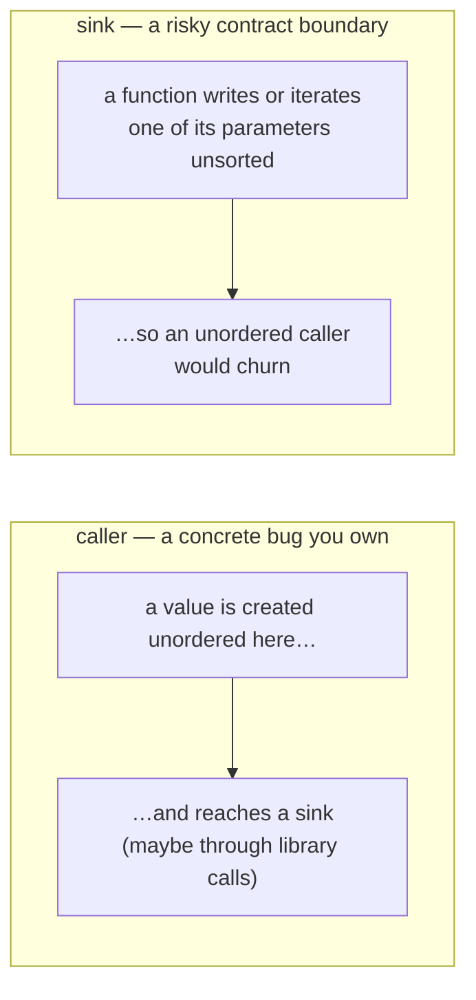

# Sinks and findings

The [taint model](taint-model.md) decides *whether a value is unstable*. This doc
covers the two ends of the report: **where instability causes trouble** (sinks) and
**how an unstable-value-reaches-a-sink flow becomes a finding**.

## Sink discovery

A *sink* is a place where unstable bytes cause real churn. There are three kinds,
each shown as `sink=` in the output.

### `databag` — relation-data writes

The original problem: an unstable databag write makes Juju see a change every hook
and fire a spurious `relation-changed` on the other side — a reconcile ping-pong.
Three shapes count as a databag write:

```python
relation.data[entity][key] = value             # assignment
relation.data[entity].update(mapping)           # update / setdefault
relation.save(obj, entity)                      # the ops typed-databag API
```

What matters is that the thing being written to *is a databag*, not the exact method
name. flaplint recognises the databag **object by provenance**, not one fixed shape,
so it follows the databag through property layers and `.get(entity)` access:

```
model.get_relation(...)   → a Relation          (the only way databag-ness enters)
        <relation>.data   → its RelationData mapping   (only on a known Relation)
        <data>[entity] / .get(entity)   → a databag
        <databag>.update(…) / [k]=… / .setdefault(…)   → a write = sink
```

So a write reaches a sink even when it's wrapped several properties deep —
`self.unit_databag.update(...)` where `unit_databag` resolves, through accessors,
back to a `get_relation(...)`. This is anchored entirely on the **ops Model API**
(`get_relation`), never on a type name like `Relation` (which a same-named user class
could fool), and `.data` is treated as a databag mapping **only** on a value already
known to be a Relation — a bare `.data` on anything else is never mistaken for one.
The provenance evaluator lives in [databag.py](../src/flaplint/databag.py).

### `file` — on-disk / workload-config writes

Unstable content written to a file, in the workload container or the charm
container. A file like this is almost always a **change-detector**: something
compares it to the previous version to decide whether to do expensive work — replan,
restart, re-render. If the bytes reshuffle, that work happens every reconcile.

Recognised writes:

| call | the content argument |
|---|---|
| `container.push(path, source)` | `source` |
| `container.add_layer(label, layer)` | `layer` |
| `Path.write_text(data)` / `write_bytes(data)` | `data` |
| `f.write(data)` / `f.writelines(lines)` | `data` / `lines` |
| `os.write(fd, data)` | `data` |

There's also one more: a function that **returns** `yaml.dump(...)` or
`json.dumps(...)`. The rendered text is handed to a caller that diffs it, so an
unstable value that survives key-sorting flaps the output.

### `hash` — content-hash change-detectors

`sha256`, `md5`, the builtin `hash`, and so on. A charm hashes some content and
compares the digest to last time to decide whether to act. Hashing an unstable value
gives a different digest for the same logical content, so that check fires every
reconcile. Hashing the unstable content *is* the sink — the tool flags it and assumes
the digest gates something, without tracing exactly what. (A `hash()` inside a
`__hash__`/`__eq__` method is normal in-process hashing, not a cross-reconcile check,
so it's ignored.)

## From taint to finding

When taint reaches a sink, it becomes a finding. Every finding has two independent
labels: a **vantage** (`kind`) and a **failure mode** (`type`).

### Vantage: `caller` vs `sink`



- **`caller`** (always high confidence): a value created unstable in this function
  reaches a sink. A concrete bug, reported at the place the value was created (the
  `set()` / `list(...)`), not the serializer.
- **`sink`** (high or medium): a function writes or iterates one of its *parameters*
  without sorting — it trusts callers to pass ordered data. Confidence depends on the
  parameter's annotation (below).

The vantage is *whose code to fix*; the failure mode is *how to fix it*. They're
independent.

### Failure modes (`type=`)

Four kinds, each a different root cause with a different fix:

| `type=` | what went wrong | the fix |
|---|---|---|
| `unordered-collection` | a whole `set`/`dict` written without sorting | `sorted(...)`, or `sort_keys=True` for dict keys |
| `unordered-pick` | one element chosen by **position** (`addrs[0]`) — survives `sort_keys=True` | `sorted(addrs)[0]` — sort before indexing |
| `unordered-iteration` | a **list built from an unordered source** (`list(some_set)`, `[… for … in …]`) — survives `sort_keys=True` | `sorted(...)` before the list is built |
| `nondeterministic` | a value that's **different every run** (`uuid4()`, `time()`) | make it stable; don't write it to the bag |

These line up with the [kinds of origin](taint-model.md#the-origin-taxonomy):
`local` → `unordered-collection`, `element` → `unordered-pick`, `itercaller` and
`iterparam` → `unordered-iteration`, `volatile` → `nondeterministic`.

### Contract-boundary `sink` findings

A `sink` finding fires when a function writes or iterates one of its parameters
unsorted. The parameter's annotation sets the confidence:

- **high** — annotated as something clearly unordered (`Set`, `Iterable`, …): we know
  the source is unordered.
- **medium** — no annotation, or `Any`: it *might* be a collection.
- **skipped** — annotated as already-ordered (`List`, `Dict`, `str`, …), so the
  caller owns the order; or annotated as a named object type like a dataclass, which
  a caller can't `sorted()` at all.

That last rule is why a function taking `ctx: Optional[ScrapeJobContext]` and writing
it to a databag is *not* flagged — there's no `sorted()` you could add at that
boundary, so the advice would be useless.

### Confirmed vs. precautionary `unordered-iteration`

`unordered-iteration` is the one mode that shows up under both vantages:

- **confirmed** (`kind=caller`, high): an unstable value was actually traced into the
  loop — either a local `list(set)` or a caller's unstable argument followed into the
  helper. A real bug.
- **precautionary** (`kind=sink`, medium): a function iterates an unannotated
  parameter into a list, but no caller has been *proven* to pass unordered data. It's
  surfaced anyway so the fix location is never a blind spot.

If a caller is later proven to pass unordered data, the confirmed finding replaces
the precautionary one at the same spot. This split is deliberate: it avoids silently
missing the bug while not crying wolf at every helper.

## Errors vs. warnings — who can fix it

Whether a finding fails CI depends only on **who owns the code**:

- **error** — the fix is in code the charm owns: its own `src/`, or its own
  `lib/charms/<charm-name>/`. Errors fail CI.
- **warning** — the fix is in a library the charm only *uses* (an installed
  dependency, or a vendored copy of another charm's lib). Shown for awareness, but it
  doesn't fail CI — you can't fix someone else's library here.

`--dep` adds a root to analyse and report on, but never changes whether a finding is
an error or a warning. See [resolving-dependencies.md](resolving-dependencies.md).

## Deduplication & suppression

Before printing, the report stage:

- drops duplicate findings for the same spot;
- drops findings below the confidence threshold (`--min-confidence`);
- honours a `# databag-order: ignore` comment on a finding's line — the escape hatch
  for an intentional, reviewed exception (for example, a `uuid4()` that exists only
  to force a state change to propagate);
- sorts what's left by severity (or by location with `--sort location`).
