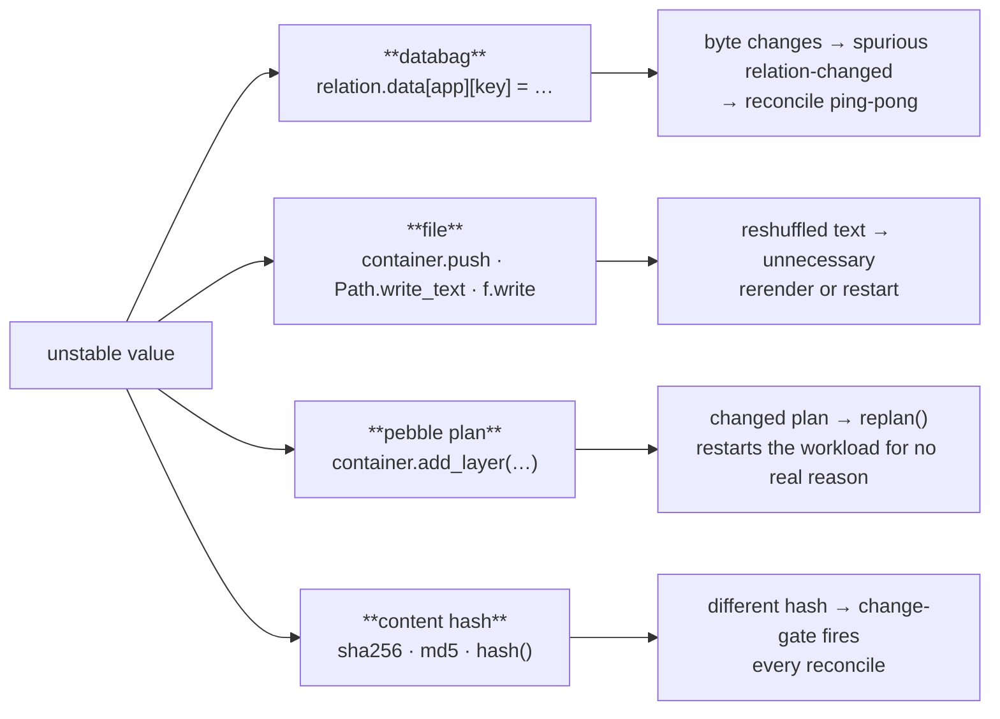
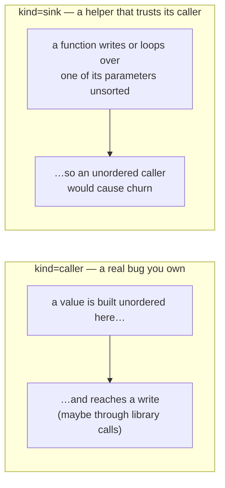

# Where it lands and what gets reported

The [previous page](taint-model.md) decides *whether a value is unstable*. This page covers where an unstable value causes trouble (the write targets) and how "an unstable value reaches a write" turns into a finding.

## The four write targets



> **One word, two uses.** `sink=` in a finding names *which write target* the value reached (`sink=databag`, `sink=file`, …). Later, `kind=sink` names a *different* thing — a finding category meaning "a helper trusts its caller". Read `sink=` as "the write target" and `kind=sink` as "the trusts-its-caller case".

### `databag` — writing to relation data

The original problem: an unstable databag write makes Juju see a change every hook and fire a spurious `relation-changed` on the other side — a reconcile ping-pong. Three shapes count as a databag write:

```python
relation.data[entity][key] = value             # assignment
relation.data[entity].update(mapping)           # update / setdefault
relation.save(obj, entity)                      # the ops typed-databag call
```

What matters is that the thing being written to **is a databag**, not the exact method name. flaplint figures out what's a databag by tracing where it came from, not by matching one fixed shape:

```
model.get_relation(...)      → a Relation          (the only starting point)
      <relation>.data        → its data mapping     (only on a known Relation)
      <data>[entity]         → a databag
      <databag>.update(…) / [k]=… / .setdefault(…) → a write
```

So a write is caught even when it's wrapped several properties deep — `self.unit_databag.update(...)` where `unit_databag` traces back through one accessor after another to a `get_relation(...)`. `.data` is treated as a databag mapping **only** on something already known to be a Relation — a bare `.data` on anything else is never mistaken for one.

### `file` — writing to a file on disk

Unstable content written to a file, in the workload container or the charm container. A file like this is almost always a **change-detector**: something compares it to the previous version to decide whether to do expensive work — replan, restart, re-render. If the text reshuffles, that work happens every reconcile.

Recognised writes:

| call | the content argument |
|---|---|
| `container.push(path, source)` | `source` |
| `Path.write_text(data)` / `write_bytes(data)` | `data` |
| `f.write(data)` / `f.writelines(lines)` | `data` / `lines` |
| `os.write(fd, data)` | `data` |

There's one more: a function that **returns** `yaml.dump(...)` or `json.dumps(...)`. The rendered text is handed to a caller that compares it, so an unstable value that survives key-sorting changes the output run-to-run.

### `plan` — a pebble plan

A pebble layer pushed with `container.add_layer(label, layer)`. When the charm calls `replan()`, pebble compares the plan you want against the running one and restarts any service whose definition changed. Unstable content in a layer makes the plan look "changed" every reconcile and restarts the workload for no real reason.

The subtle part: pebble does **not** compare the layer's text character-for-character. It reads the layer into structured form, merges it, and compares the merged *service definitions*. That comparison ignores the order of mapping fields — exactly as a key-sorting serializer would. So a plan write follows the same rules as a databag, not the exact-text rules of a file:

- a `command` built by joining an unordered set (`" ".join(peers)`), a list-valued field, a value picked by position, or a `uuid4()`/`time()` value → **changes**, flagged
- a bare `set` or out-of-order dict keys in a mapping field → **pebble sorts it out**, not flagged

That's why `add_layer` is its own kind of write: its content is compared by structure, so it follows the same "what survives" rules as `databag` and `hash`, not the exact-text rules of a file on disk.

### `hash` — a content hash used to detect change

`sha256`, `md5`, the built-in `hash`, and so on. A charm hashes some content and compares the result to last time to decide whether to act. Hashing an unstable value gives a different result for the same real content, so that check fires every reconcile.

Hashing the unstable content **is** the write — the tool flags it and assumes the result gates something, without tracing exactly what. (A `hash()` inside a `__hash__` / `__eq__` method is ordinary in-memory hashing, not a change-detector across reconciles, so it's ignored.)

---

## From an unstable value to a finding

When an unstable value reaches a write, it becomes a finding. Every finding carries two independent labels: **whose code to fix** (`kind`) and **what went wrong** (`type`).

### Whose code to fix: `caller` vs. `sink`



- **`caller`** (always high confidence): a value built unstable in *this* function reaches a write. A real bug, reported at the place the value was built (the `set()` / `list(...)`) — not the serializer.
- **`sink`** (high or medium): a function writes or loops over one of its *parameters* without sorting. It trusts callers to hand in ordered data. Confidence depends on the parameter's type hint (below).

`kind` is *whose code to fix*; `type` is *how to fix it*. They're independent.

### What went wrong (`type=`)

| `type=` | what went wrong | the fix |
|---|---|---|
| `unordered-collection` | a whole `set`/`dict` written without sorting | `sorted(...)`, or `sort_keys=True` for dict keys |
| `unordered-pick` | one item chosen by **position** (`addrs[0]`) — survives `sort_keys=True` | `sorted(addrs)[0]` |
| `unordered-iteration` | a **list built from something unordered** (`list(some_set)`, `[… for … in …]`) — survives `sort_keys=True` | `sorted(...)` before the list is built |
| `nondeterministic` | a value that's **different every run** (`uuid4()`, `time()`) | make it stable / don't write it to the bag |

These map to the [six instability labels](taint-model.md#the-six-kinds-of-instability): `local` → `unordered-collection`, `element` → `unordered-pick`, `itercaller` and `iterparam` → `unordered-iteration`, `volatile` → `nondeterministic`.

### When a helper trusts its caller

A `sink` finding fires when a function writes or loops over one of its parameters without sorting. The parameter's type hint sets the confidence:

- **high** — hinted as something clearly unordered (`Set`, `Iterable`, …): we know the source is unordered.
- **medium** — no hint, or `Any`: it *might* be a collection.
- **skipped** — hinted as already-ordered (`List`, `Dict`, `str`, …), so the caller owns the order; or hinted as a named object type like a dataclass, which a caller can't `sorted()` at all.

That last rule is why a function taking `ctx: Optional[ScrapeJobContext]` and writing it to a databag is *not* flagged — there's no `sorted()` you could add, so the advice would be useless.

### Confirmed vs. just-in-case `unordered-iteration`

`unordered-iteration` shows up under both `kind`s:

- **confirmed** (`kind=caller`, high): an unstable value was actually traced into the loop — a real bug.
- **just-in-case** (`kind=sink`, medium): a function loops a parameter (no type hint) into a list, but no caller has been *proven* to pass unordered data. Surfaced anyway so the fix site is never a blind spot.

If a caller is later proven to pass unordered data, the confirmed finding replaces the just-in-case one at the same spot.

---

## Errors vs. warnings — who can fix it

Whether a finding fails CI depends only on **who owns the code**:

- **error** (`✖`) — the fix is in code the charm owns: its own `src/`, or its own `lib/charms/<charm-name>/`. Errors fail CI.
- **warning** (`▲`) — the fix is in a library the charm only *uses* (an installed dependency, or a vendored copy of another charm's lib). Shown for awareness, doesn't fail CI.

`--dep` adds a root to analyse and report on, but never changes whether a finding is an error or a warning. See [resolving-dependencies.md](resolving-dependencies.md).

## Removing duplicates and silencing lines

Before printing, the report stage:

- drops duplicate findings for the same spot;
- drops findings below the confidence threshold (`--min-confidence`);
- honours a `# databag-order: ignore` comment on a finding's line — the escape hatch for a deliberate, reviewed exception (for example, a `uuid4()` that exists only to force a change to propagate);
- sorts what's left by severity (or by location with `--sort location`).
